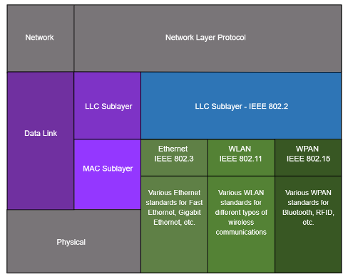

# OSI 2: Data Link Layer

<u>Data Link</u> 
\- Transmits frames 
\- Encapsulates the network layer into frames 
\- Performs error detection on frames 

802 is the Ethernet standard (February 1980) 

**Logical Link Control (LLC)** $\rightarrow$ communicates between networking software (upper layers) and device hardware (lower layers) 
**Media Access Control (MAC)** $\rightarrow$ responsible for data encapsulation and media access control 

</u>Router Layer 2 Functions</u> 
\- accepts a frame from the network medium 
\- de-encapsulates and parses the data 
\- re-encapsulates 
\- forwards it to appropriate next segment 

## Common WAN Topologies ##
<u>Point-to-point</u> 
\- simplest and most common wan topology 
\- permanent link between two endpoints 

<u>Hub and Spoke</u> 
\- interconnects branch sites through point-to-point links 
\- airline topology 

<u>Mesh</u> 
\- high availability 
\- expensive interconnectivity 
\- number of connections between $n$ points $= \large \frac{n(n-1)}{2}$ 

<u>Former Topologies</u> 
\- Bus: systems chained together linearly and terminated at each end 
\- Ring: Bus but the two ends connect 

## Carrier Sense Multiple Access (CSMA) ##

Half duplex $\rightarrow$ only one device can send or receive at a time (WLAN and bus) 
Full duplex $\rightarrow$ transmit and receive on shared medium (Ethernet switches) 

<u>With Collision Detection (CSMA/CD)</u> 
\- half duplex 
\- simultaneous transmission will emit collision signal 
\- devices detect collision 
\- devices wait a random period of time and retransmit 

<u>With Collision Avoidance (CSMA/CA)</u> 
\- half duplex 
\- algorithm governs when a device can send 
\- during transmission, devices include a time duration needed for transmission 
\- other devices receive the time duration message and know when medium will be next available 

<u>Contention-Based Access</u> 
\- all node operate in half-duplex 
\- compete for use of the medium 
\- CSMA/CD: bus-topology Ethernet 
\- CSMA/CA: WLANs 

<u>Controlled Access</u> 
\- each node has its own time on the medium 
\- used on ARCNET and Token Ring 

## Datalink Frame ##
<u>Part 1: Header</u> 
\- Frame Start: announces beginning of frame 
\- Addressing: source and dest nodes 
\- Type: identifies encapsulated Layer 3 protocol 
\- Control: identifies flow control services  

<u>Part 2: Data</u> 
\- payload 

<u>Part 3: Trailer</u> 
\- Error Detection: helps to determine transmission errors 
\- Frame Stop: announces end of frame 