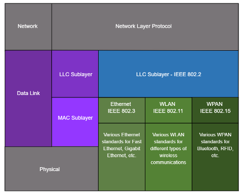

# OSI 2: Data Link Layer
\- Transmits frames  
\- Encapsulates the network layer into frames  
\- Performs error detection on frames

802 is the Ethernet standard (February 1980)  

**Logical Link Control (LLC)**  
\- communicates between networking software (upper layers) and device hardware (lower layers)  
\- primarily concerned with (de)multiplexing data  
\- handles flow control and error management (except CSMA/CA)

<u>Router Layer 2 Functions</u>  
\- accepts a frame from the network medium  
\- de-encapsulates and parses the data  (determines best route)  
\- re-encapsulates  
\- forwards it to appropriate next segment
## Common WAN Topologies ##
<u>Point-to-point</u>  
\- simplest and most common WAN topology  
\- static link between two endpoints

<u>Hub and Spoke</u>  
\- interconnects branch sites through point-to-point links  
\- airline topology

<u>Mesh</u>  
\- high availability  
\- expensive interconnectivity  
\- number of connections between $n$ points $= \large \frac{n(n-1)}{2}$

<u>Former Topologies</u>  
Bus: systems chained together linearly and terminated at each end  
Ring: Bus but the two ends connect

<u>Hybrid Topologies</u>  
\- combine multiple topologies  
ex: extended star

## Media Access Control (MAC)
\- controls hardware interaction with wire(less) transmission medium

<u>Main Functions</u>  
\- frame delimiting and recognition  
\- protection against errors, generally by means of generating and checking FCS  
\- Control of access to the physical transmission medium  
\- receive/transmit normal frames  
\- half-duplex retransmission and backoff functions  
\- discard malformed frames
### Carrier Sense Multiple Access (CSMA) ###
Half duplex $\rightarrow$ only one device can send or receive at a time (WLAN and bus)  
Full duplex $\rightarrow$ transmit and receive on shared medium (Ethernet switches)

<u>With Collision Detection (CSMA/CD)</u>  
\- half duplex  
\- simultaneous transmission will emit collision signal  
\- devices detect collision  
\- devices wait a random period of time and retransmit

<u>With Collision Avoidance (CSMA/CA)</u>  
\- half duplex  
\- algorithm governs when a device can send  
\- during transmission, devices include a time duration needed for transmission  
\- other devices receive the time duration message and know when medium will be next available

<u>Contention-Based Access</u>  
\- all node operate in half-duplex  
\- compete for use of the medium  
\- CSMA/CD: bus-topology Ethernet  
\- CSMA/CA: WLANs

<u>Controlled Access</u>  
\- each node has its own time on the medium  
\- used on ARCNET and Token Ring

## Datalink Frame Header ##
<u>Part 1: Header</u>  
\- Frame Start: announces beginning of frame  
\- Addressing: source and dest nodes  
\- Type: identifies encapsulated Layer 3 protocol  
\- Control: identifies flow control services 

<u>Part 2: Data</u>  
\- payload

<u>Part 3: Trailer</u>  
\- Error Detection: helps to determine transmission errors  
\- Frame Stop: announces end of frame