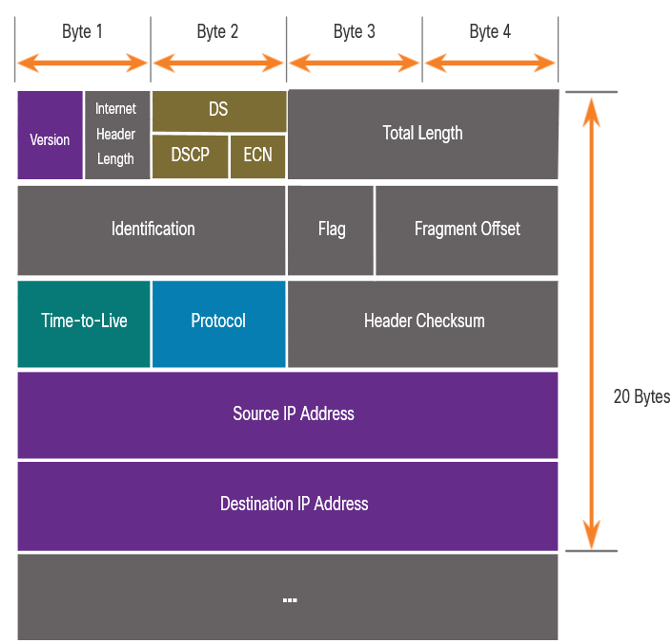
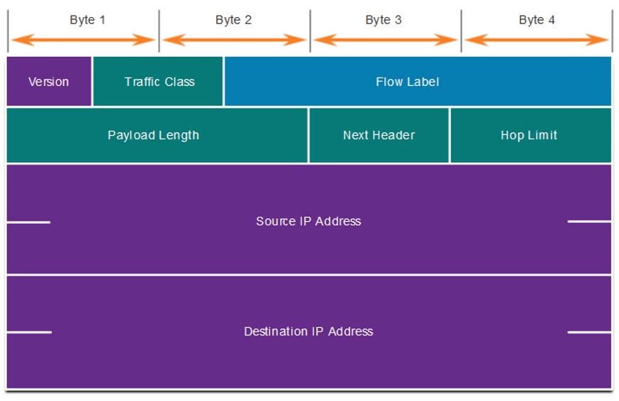

# OSI Layer 3: Network Layer #
\- responsible for addressing and routing  
\- encapsulates and de-encapsulates data

<u>IP Encapsulation</u>  
\- encapsulates the transport layer segment  
\- can use either IPv4 or IPv6 and not impact the layer 4 segment  
\- IP addressing does not change from source to dest (except NAT)  
\- all layer 3 devices will examine an IP packet

## Characteristics of IP ##
<u>Connectionless</u>  
\- ip does not establish a connection before sending, just sends  
\- no control info or pre-notifications needed  
\- if connection-oriented traffic is needed, a different protocol will be used (ex TCP)

<u>Best Effort</u>  
\- IP does not guarantee delivery  
\- packet is transmitted as quickly and efficiently as possible  
\- error management falls to other protocols  
\- no mechanism to resend data (some packets may be lost enroute)  
\- no acknowledgements (low overhead)  
\- re: connectionless

<u>Media Independent</u>  
\- does not care what happens at the data link level (connection type doesn't matter)  
\- cannot fix undelivered or corrupt packets  
\- IP has to break packets into pieces to accommodate lower layer Maximum Transmission Unit (MTU)

<u>Fragmenting</u>  
\- IPs breaks larger packets into pieces that can be transmitted at lower layer MTU  
\- fragmenting causes latency  
\- IPv4 must fragment and reassembly  
\- IPv6 packets cannot be fragmented by anything but the source

<u>IPv4 Packet Header</u>  
\- 20 bytes for IPv4 network  
  
\- version 4  
\- total length $\rightarrow$ header + data  
\- fragment offset $\rightarrow$ helps reassembly by indicating which bytes are present  
\- time to live $\rightarrow$ prevents infinite looping (default 255, decremented by each router that processes)  
\- checksum $\rightarrow$ re-calculated after time to live is updated

<u>IPv6 Packet Header</u>  
\- 40 bytes (simplified but not smaller--larger ip addresses)  
\- no fragmenting (only source can fragment)  
\- no checksum  
  
\- version 6  
\- payload length $\rightarrow$ length of the data portion  
\- next header $\rightarrow$ protocol type  
\- hop limit $\rightarrow$ time to live  
\- extension header $\rightarrow$ optional information used for fragmentation, security, mobility support  
*due to re-assembly and checksum, IPv6 is faster than IPv4*

## Host Routing ##
<u>Forwarding Determination</u>  
\- packets are always created at source  
\- layer 3 (network) responsible for routing  
\- loopback $\rightarrow$ 127.0.0.0 or ::1  
\- go to local or remote hosts (tell difference based on subnet mask)  
*remote dests go to "default gate"*

<u>Default Gateway (DGW)</u>  
\- just the IP address of the nearest router  
\- must be on the same subnet as LAN (sometimes highest valid host)  
\- configured statically or through DHCP

<u>Host Routing Tables</u>  
\- default route is the default gateway  
\- interface list $\rightarrow$  all potential interfaces and MAC addresses

<u>Basic Routing</u>  
*ip header (Layer 3) never changes*  
\- Layer 2: source uses the MAC address of the router (discover via ARP) to send packet to gateway  
\- Layer 2: router 1 receives frame and de-encapsulates  
\- Layer 3: determines next dest  
\- Layer 2: determines next MAC address and re-encapsulates (source is now router)  
\- Layer 2: send to next MAC Address (discover via ARP)

<u>Router Routing Table</u>  
Directly Connected $\rightarrow$ routes are automatically added (when interface is active)  
Remote $\rightarrow$ must be learned either statically or dynamically (DHCP)  
Remote (Default Route) $\rightarrow$ used when there is no match in the routing table  
`show ip route` to display connections
