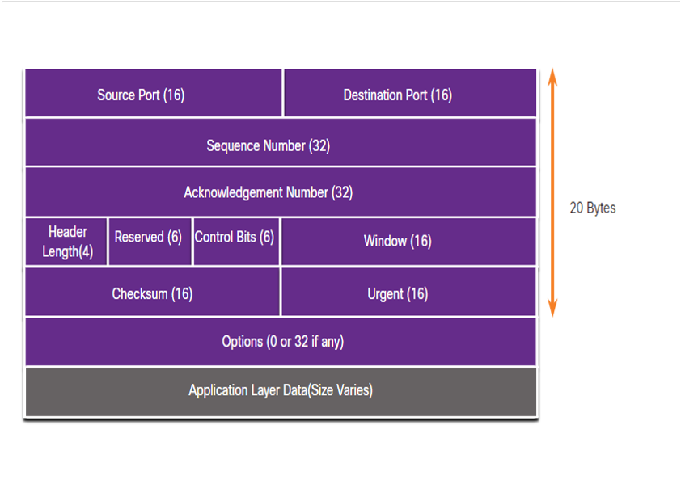
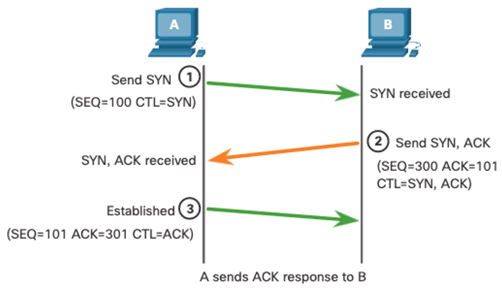
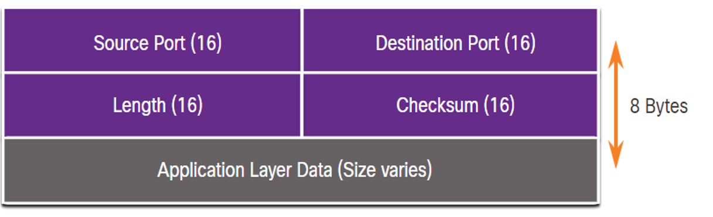
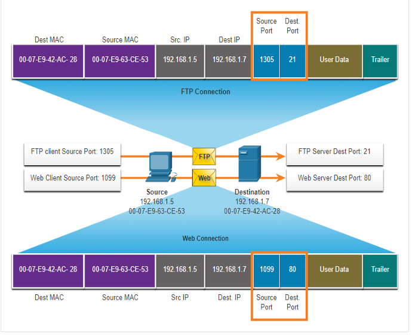
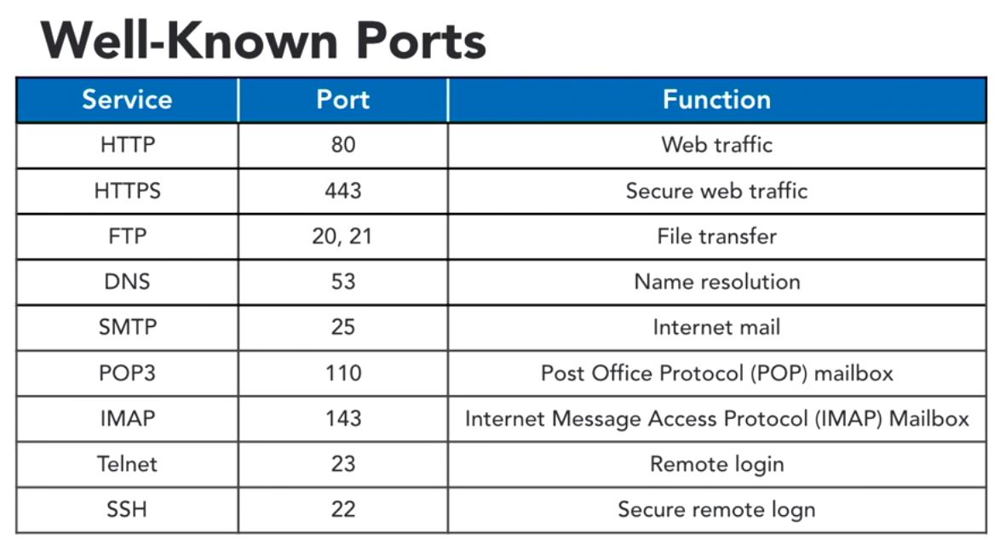

# OSI 4: Transport Layer

\- segmenting and reassembling data
\- adds leader info
\- manage conversations

## Transmission Control Protocol (TCP)

<u>Connection Oriented</u>
\- sequencing, acknowledgement, retransmission
\- flow rate control
\- TCP three-way handshake

<u>TCP Header</u>
\- 20 bytes

\- source and destination port
\- sequence number $\rightarrow$ packet number
\- acknowledgement number $\rightarrow$ what to expect next
\- window size $\rightarrow$ flow control
\- control bits $\rightarrow$ TCP flag 

<u>Three Way Handshake</u>

1. client initiates client-to-server session with the server (SYN, SEQ)
2. the server acknowledge session and requests server-to-client session (SEQ, ACK, CTL=SYN, ACK)
3. client acknowledges server to client session (SEQ, ACK, CTL=ACK)

<u>Half Open Window</u>
\- DDOS attack (opens multiple ports and sucks up memory)
\- set time and rate limits to prevent predicatable DDOS patterns

<u>Session Termination</u>

1. client sends FIN
2. server sends ACK and FIN
3. client sends ACK

CTL $\rightarrow$ control fields
URG $\rightarrow$ indicates priority
ACK $\rightarrow$ acknowledgement number (packet received)
PSH $\rightarrow$ request immediate data delivery to receiving host, without waiting for buffering
RST $\rightarrow$ reset (terminate session immediately without fin-ack process)
SYN $\rightarrow$ sequence number (packet sent)
FIN $\rightarrow$ connection termination
CHK $\rightarrow$ checksum
SEQ $\rightarrow$ sequence number

<u>(Old) ACK</u>
\- only represented the last packet received before packet loss
\- client would have to re-send all post-ack packets, even if some had been received successfully

<u>SACK</u>
\- if both hosts support SACK, reduces redundant retransmission
\- Selective acknowledgement allows for the retransmission of *just* the dropped packet(s)

<u>Maximum Segment Size (MSS)</u>
At Layer 2: TCP and IPv4 headers reduce MSS to 1460
\- even if a device can receive more at Layer 3, it is still hindered by the Layer 2 MSS

<u>Congestion Avoidance</u>
\- retransmissions due to congestion can exacerbate congestion
\- different algorithms

## User Datagram Protocol (UDP)

<u>Connectionless</u>
\- best-effort
\- no reliability or acknowledgement
\- little overhead or checking

<u>UDP Header</u>
\- 8 bytes

\- source and dest ports
\- length $\rightarrow$ length of the header

## Port Numbers

<u>Socket Pairs</u>
\- source port number is randomly generated bc it doesn't matter
\- dest port matches application protocol
*IP + port = socket*
\- sockets are unique (hosts will not generate a duplicate source port)
\- sockets allow for multiple processes on the same client or host to distinguish themselves

only one application can be listening on a port at a time
