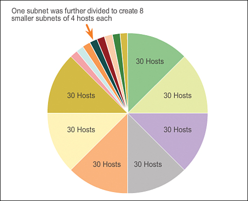

# Key Points #

## Device Config ##
<u>Initial Set-Up</u> 
`> enable` switch to exec mode 

`# configure terminal` 
`(config)# hostname name` change hostname 
`(config)# no ip domain-lookup` disable DNS lookup to prevent interpreting incorrect commands as hostnames 
`(config)# enable secret password` protects privileged EXEC mode 

`(config)# line config 0` switch to line config 
`(config-line)# password password` protect console access 
`(config-line)# login` 
`(config-line)# exit` 

`(config)# interface interface`switch to interface config 
`(config-if)# ip address address` configure ip address 
`(config-if)# ipv6 address address/prefix` configure ipv6 address 
`(config-if)# ipv6 unicast routing` enable IPv6 unicast routing 
`(config-if)# no shut` 
`(config-if)# exit` 

`(config)# banner motd #Unauthorized access is prohibited.#` adds access banner 
`(config)# exit` 
`(config)# copy running-config startup-config` 

<u>VTY Console</u> 
[this article kinda helps](https://www.techrepublic.com/article/configure-lines-and-vtys-on-cisco-routers/) 
\- virtual teletype 
\- basically like ports you can ssh or telnet into 
\- impacted by line-config mode 

`# line vty 0 15` sets up 16 (numbered) vty lines 

## IP Network Casting ##
More in depth at [Github Gist](https://gist.github.com/MangaD/be346bf566e70773e2836c4a4a0bef6d)

<u>Multicast</u> 
\- one-to-many or many-to-many communication 
\- source can send data to a group of interested recipients without duplication at the source 
\- routers replicate packets only as needed 
\- dynamic grouping (hosts can leave and join as needed) 

<u>Anycast</u> 
\- one-to-nearest communication (IPv6 only) 
\- data is sent to the topologically closest node among a group 
\- standard unicast addresses are assigned to multiple devices 
\- unicast with multiple dests

<u>Broadcast</u> 
\- one-to-all (IPv4 only) 
\- floods the network 

<u>Unicast</u> 
\- 1-1 communication 
\- unique (either locally or globally)

## OSI Model ##

<u>Physical Layer</u> 
\- last step in encapsulation 
\- the bits are encoded and transmitted between devices 
\- connection can be wired or wireless 

<u>Data Link Layer</u> 
\- accepts a frame from the network medium 
\- de-encapsulates and parses the data 
\- re-encapsulates 
\- forwards it to appropriate next segment 
**Logical Link Control (LLC)** $\rightarrow$ communicates between networking software (upper layers) and device hardware (lower layers) 
**Media Access Control (MAC)** $\rightarrow$ responsible for data encapsulation and media access control 

## Subnetting ##
<u>Network bits cannot be changed</u> 
Ex: 10.0.0.0/8 $\rightarrow$ network is 10 
Ex: 10.0.0.0/16 $\rightarrow$ network is 10.0.0 

<u>Valid Hosts</u> 
\- $2^h - 2$ ($h =$ number of host bits) 
\- the 2 invalid host addresses are when the host bit are all zeroes or all ones (broadcast address) 
\- when host bits are all 0, it indicates the network as a whole--does not point to a host 

<u>Number of Subnets</u> 
\- "borrow" from host bits 
\- $2^n =$ number of subnets ($n =$ number of "borrowed" bits) 
Ex: 192.168.1.0/24 $\rightarrow$ 192.168.1.0/26 = add 4 new networks 

 
Academy, C., & Cisco Networking Academy Program,  author. (2013). Network Basics Companion Guide / Academy, Cisco. (1st edition). Cisco Press.

## Ethernet Frame ##

<u>MAC Address Assignment</u> 
\- Organizationally Unique Identifier (OUI): 24 bits 
\- Vendor Assigned: 24 bits 

<u>Ethernet Frame Fields</u> 
\- 6 bytes: Dest MAC address 
\- 6 bytes: Source MAC address 
\- 2 bytes: Type/length 
\- 46-1500 bytes: Data 
\- 4 bytes: Checksum 

**Minimum 64 bytes** (collision detection) $\rightarrow$ Anything less is a runt and dropped 
**Max 1518 bytes** (memory management) $\rightarrow$ Anything more is giant and (can be) error frame 

<u>NIC Processing</u> 
\- NIC receives Ethernet frame 
\- if dest address matches device address (in RAM), frame is passed up the layers for de-encapsulation 
\- otherwise, device discards frame 

### MAC Addresses ###

<u>Multicast MAC Address</u> 
IPv4 address $\rightarrow$ 01-00-5E 
IPv6 address $\rightarrow$ 01-00-33-33 
\- flooded out to all switch ports (except source port) 
\- not forwarded by the router (unless otherwise configured) 
\- used as a destination packet only 

<u>Content Addressable Memory (CAM)</u> 
\- switches match ports and IP addresses based on the source address 
\- adds source (mac, port, time to live) to MAC table 
\- unicast forwarding (looks at table first to avoid flooding) 
_if broadcast or multicast, flood to all ports except where it came from_ 

## Important to Memorize ##

<u>Definitions</u> 
**Hextet**: set of 4 hexadecimal (hex + tetra) 
**NIC**: network interface card 

<u>RFC 1918 Private Addressing</u> 
\- 10.0.0.0/8 
\- 172.16.0.0/12  
\- 192.168.0.0/16 

<u>RFC 790 Classes</u> 
**A** (000-127/8) (GE, but took it back) (most networks, least hosts) 
**B** (128-191/16) (balanced) 
**C** (192-233/24) (least networks, most hosts)** 
**D** (224-239) multicasting 
**E** (240-255) reserved (nobody cares, don't neet to know) 
