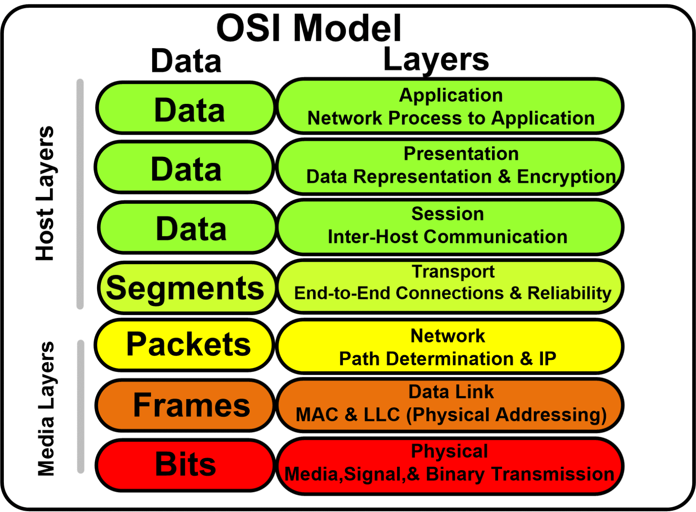
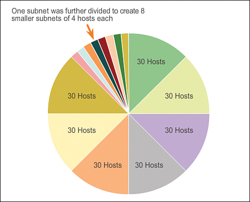

# Key Points #

## Device Config ##
<u>Basic Terminal Setup</u>  
`> enable` switch to exec mode  
`# configure terminal`  
`(config)# hostname name` change hostname  
`(config)# no ip domain-lookup` disable DNS lookup to prevent interpreting incorrect commands as hostnames  
`(config)# enable secret password` protects privileged EXEC mode with password "password"

<u>Protect Console</u>  
`(config)# line con 0` switch to console config  
`(config-line)# password password` protect console access with password "password"  
`(config-line)# login`  
`(config-line)# exit`

<u>Interface Config</u>  
\- VLAN 1 for switches and Gigabit/Ethernet for routers and PCs  
`(config)# interface interface`switch to interface config  
`(config-if)# ip address address` configure ip address  
`(config-if)# ipv6 address address/prefix` configure ipv6 address  
`(config-if)# ipv6 unicast routing` enable IPv6 unicast routing  
`(config-if)# no shut`  keep interface up  
`(config-if)# exit`

<u>Final Touches</u>  
`(config)# banner motd #Unauthorized access is prohibited.#` adds access banner  
`(config)# exit`  
`(config)# copy running-config startup-config`

<u>Required Password Commands</u>  
`(config)# enable secret password` protect exec mode  
`(config)# line con 0` move to console config  
`(config-line)# password password` protect console config  
`(config)# service password-encryption` encrypt passwords  

<u>VTY Console</u>  
[this article kinda helps](https://www.techrepublic.com/article/configure-lines-and-vtys-on-cisco-routers/)  
\- virtual teletype  
\- basically like ports you can ssh or telnet into  
\- impacted by line-config mode  
![[cisco-ios-tree.avif]]
## IP Network Casting ##
More in depth at [Github Gist](https://gist.github.com/MangaD/be346bf566e70773e2836c4a4a0bef6d)

<u>Multicast</u>  
\- one-to-many or many-to-many communication  
\- source can send data to a group of interested recipients without duplication at the source  
\- routers replicate packets only as needed  
\- dynamic grouping (hosts can leave and join as needed)

<u>Anycast</u>  
\- one-to-nearest communication (IPv6 only)  
\- data is sent to the topologically closest node among a group  
\- standard unicast addresses are assigned to multiple devices  
\- unicast with multiple dests

<u>Broadcast</u>  
\- one-to-all (IPv4 only)  
\- floods the network

<u>Unicast</u>  
\- 1-1 communication  
\- unique (either locally or globally)

## OSI Model ##

<u>Physical Layer</u>  
\- last step in encapsulation  
\- the bits are encoded and transmitted between devices  
\- connection can be wired or wireless

<u>Data Link Layer</u>  
\- accepts a frame from the network medium  
\- de-encapsulates and parses the data  
\- re-encapsulates  
\- forwards it to appropriate next segment  
**Logical Link Control (LLC)** $\rightarrow$ communicates between networking software (upper layers) and device hardware (lower layers)  
**Media Access Control (MAC)** $\rightarrow$ responsible for data encapsulation and media access control

## Subnetting ##
<u>Network bits cannot be changed</u>  
Ex: 10.0.0.0/8 $\rightarrow$ network is 10  
Ex: 10.0.0.0/16 $\rightarrow$ network is 10.0.0

<u>Valid Hosts</u>  
\- $2^h - 2$ ($h =$ number of host bits)  
\- the 2 invalid host addresses are when the host bit are all zeroes or all ones (broadcast address)  
\- when host bits are all 0, it indicates the network as a whole--does not point to a host

<u>Number of Subnets</u>  
\- "borrow" from host bits  
\- $2^n =$ number of subnets ($n =$ number of "borrowed" bits)  
Ex: 192.168.1.0/24 $\rightarrow$ 192.168.1.0/26 = add 4 new networks

<u>Variable Length Subnet Masking</u>

  
Academy, C., & Cisco Networking Academy Program,  author. (2013). Network Basics Companion Guide / Academy, Cisco. (1st edition). Cisco Press.

## Ethernet Frame ##

<u>MAC Address Assignment</u>  
\- Organizationally Unique Identifier (OUI): 24 bits  
\- Vendor Assigned: 24 bits

<u>Ethernet Frame Fields</u>  
\- 6 bytes: Dest MAC address  
\- 6 bytes: Source MAC address  
\- 2 bytes: Type/length  
\- 46-1500 bytes: Data  
\- 4 bytes: Checksum

**Minimum 64 bytes** (collision detection) $\rightarrow$ Anything less is a runt and dropped  
**Max 1518 bytes** (memory management) $\rightarrow$ Anything more is giant and (can be) error frame

<u>NIC Processing</u>  
\- NIC receives Ethernet frame  
\- if dest address matches device address (in RAM), frame is passed up the layers for de-encapsulation  
\- otherwise, device discards frame

### MAC Addresses ###

<u>Multicast MAC Address</u>  
IPv4 address $\rightarrow$ 01-00-5E  
IPv6 address $\rightarrow$ 01-00-33-33  
\- flooded out to all switch ports (except source port)  
\- not forwarded by the router (unless otherwise configured)  
\- used as a destination packet only

<u>Content Addressable Memory (CAM)</u>  
\- switches match ports and IP addresses based on the source address  
\- adds source (mac, port, time to live) to MAC table  
\- unicast forwarding (looks at table first to avoid flooding)  
_if broadcast or multicast, flood to all ports except where it came from_

## Important to Memorize ##

<u>Definitions</u>  
**Hextet**: set of 4 hexadecimal (hex + tetra)  
**NIC**: network interface card

<u>RFC 1918 Private Addressing</u>  
\- 10.0.0.0/8  
\- 172.16.0.0/12  
\- 192.168.0.0/16

<u>RFC 790 Classes</u>  
**A** (000-127/8) (GE, but took it back) (most networks, least hosts)  
**B** (128-191/16) (balanced)  
**C** (192-233/24) (least networks, most hosts)**  
**D** (224-239) multicasting  
**E** (240-255) reserved (nobody cares, don't neet to know)
